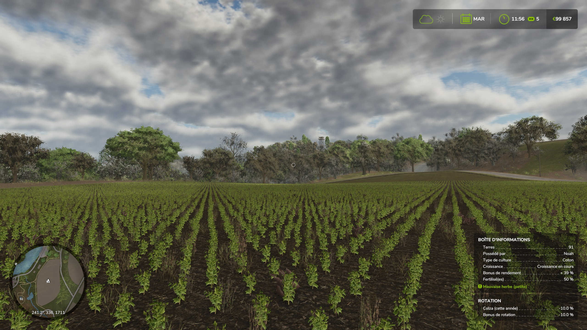
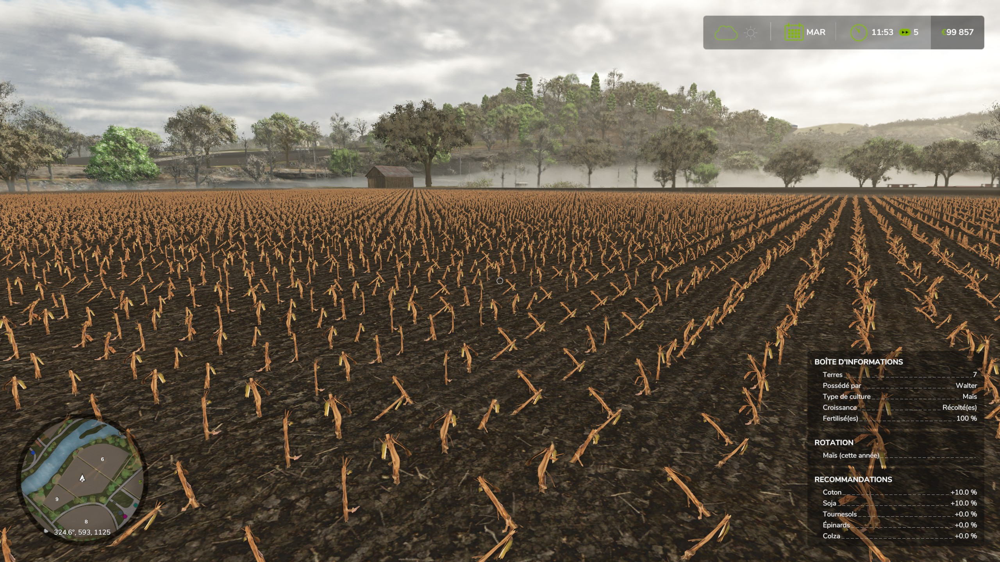

# FS25_FieldRotation

A Farming Simulator 25 mod that implements a comprehensive field rotation system to enhance crop management and yields.

⚠️ ALPHA VERSION - This mod is currently in development and may contain bugs. Use at your own discretion.  Pleave leave bug reports or feedback.

## Features
- Dynamic yield adjustments based on previous crops harvested on each field
- Field HUD display showing recently harvested crops
- Smart recommendations for optimal crop selection after harvest
- Random field history generation upon initial installation

    
    

## Crop Rotation System

The mod implements a sophisticated crop rotation system that affects field yields based on previously harvested crops. This creates a more realistic and strategic farming experience.

### How It Works
- Each field's yield is influenced by crops harvested in the past 2 years
- Crops harvested within the last 12 months have full effect on the yield multiplier
- Crops harvested between 12-24 months ago have half the effect on the yield multiplier
- Monoculture (growing the same crop repeatedly) typically results in lower yields

### Rotation Multipliers

| Previous ↓ / Current → | WHEAT  | BARLEY | CANOLA  | OAT  | MAIZE  | SUNFLOWER | SOYBEAN  | POTATO  | SUGARBEET | GRASS | SUGARCANE | COTTON  | SORGHUM  | BEETROOT  | CARROT  | PARSNIP  | GREENBEAN | PEA  | SPINACH | OILSEEDRADISH |
|------------------------|--------|--------|---------|------|--------|-----------|----------|---------|-----------|-------|-----------|---------|----------|-----------|---------|----------|-----------|------|---------|---------------|
| WHEAT                  | -20%   | -20%   | +10%    | -20% | -15%   | +10%      | +10%     | +10%    | +10%      | +10%  | -         | +10%    | -15%     | +10%      | +10%    | +10%     | +10%      | +10% | +10%    | +10%          |
| BARLEY                 | -20%   | -20%   | +10%    | -20% | -20%   | +10%      | +10%     | +10%    | +10%      | +10%  | -         | -       | -20%     | +10%      | +10%    | +10%     | +10%      | +10% | +10%    | +10%          |
| CANOLA                 | -      | -      | -30%    | -    | -      | -20%      | +20%     | -       | -         | -     | -         | -10%    | -        | -         | -       | -        | -         | -    | -       | -30%          |
| OAT                    | -20%   | -20%   | +10%    | -20% | -20%   | -         | +10%     | +10%    | +10%      | +10%  | -         | -       | -20%     | +10%      | +10%    | +10%     | +10%      | +10% | +10%    | +10%          |
| MAIZE                  | -15%   | -15%   | -       | -15% | -20%   | -         | +25%     | -       | -20%      | +15%  | +10%      | +10%    | -20%     | -         | -       | -        | +10%      | +10% | -       | +15%          |
| SUNFLOWER              | -      | -      | -20%    | -    | -      | -20%      | -        | -       | -         | -     | -         | -10%    | -        | -         | -       | -        | +10%      | +10% | -       | -20%          |
| SOYBEAN                | +20%   | +20%   | +20%    | +20% | +25%   | +20%      | -30%     | +20%    | +20%      | -     | +25%      | +25%    | +25%     | +20%      | +20%    | +20%     | -20%      | -30% | +25%    | +20%          |
| POTATO                 | +10%   | +10%   | -       | -    | -      | -         | +20%     | -30%    | -30%      | +15%  | +10%      | -       | -        | -20%      | -20%    | -20%     | +10%      | +10% | +10%    | +10%          |
| SUGARBEET              | -      | -      | -       | -    | -20%   | -         | +20%     | -30%    | -30%      | +15%  | -20%      | -       | -        | -30%      | -30%    | -30%     | +10%      | +10% | +10%    | +10%          |
| SUGARCANE              | -      | -      | -       | -    | +10%   | -         | +25%     | +10%    | -20%      | -     | -         | -       | -        | -         | -       | -        | +25%      | +25% | -       | -             |
| COTTON                 | -      | -      | -10%    | -    | -      | -10%      | +25%     | -       | -         | -     | -         | -30%    | -        | -         | -       | -        | +10%      | +10% | -       | -             |
| SORGHUM                | -15%   | -15%   | -       | -15% | -20%   | -         | +25%     | -       | -         | -     | -         | -       | -20%     | -         | -       | -        | -         | -    | -       | -             |
| BEETROOT               | -      | -      | -       | -    | -      | -         | +20%     | -20%    | -30%      | -     | -         | -       | -        | -20%      | -10%    | -10%     | +10%      | +10% | -       | -             |
| CARROT                 | -      | -      | -       | -    | -      | -         | +20%     | -20%    | -30%      | -     | -         | -       | -        | -10%      | -20%    | -20%     | +10%      | +10% | -       | -             |
| PARSNIP                | -      | -      | -       | -    | -      | -         | +20%     | -20%    | -30%      | -     | -         | -       | -        | -20%      | -20%    | -20%     | +10%      | +10% | -       | -             |
| GREENBEAN              | -      | -      | -       | -    | +10%   | +10%      | -20%     | +10%    | +10%      | -     | -         | +10%    | -        | +10%      | +10%    | +10%     | -20%      | -20% | -       | -             |
| PEA                    | -      | -      | -       | -    | +10%   | +10%      | -20%     | +10%    | +10%      | -     | -         | +10%    | -        | +10%      | +10%    | +10%     | -20%      | -20% | -       | -             |
| SPINACH                | -      | -      | -       | -    | -      | -         | +25%     | +10%    | +10%      | -     | -         | -       | -        | -         | -       | -        | -         | -    | -30%    | +15%          |
| GRASS                  | +10%   | +10%   | -       | -    | +15%   | -         | -        | +15%    | +15%      | -     | +15%      | +15%    | +15%     | +10%      | +10%    | +10%     | +10%      | +10% | +10%    | +15%          |
| OILSEEDRADISH          | -      | -      | -30%    | -    | +15%   | -20%      | +20%     | +10%    | +10%      | -     | -         | -       | -        | -         | -       | -        | -         | -    | -       | -30%          |

### Yield Calculation Examples

Example 1: Growing **OAT**
- Current year: SOYBEAN (+20% full effect)
- Previous year: BARLEY (-20% half effect = -10%)
- Total rotation bonus: +10%

Example 2: Growing **WHEAT**
- Current year: WHEAT (-20% full effect)
- Previous year: WHEAT (-20% half effect = -10%)
- Total rotation bonus: -30%

### Customization
- All rotation multipliers can be modified in the `FieldRotation.xml` file within the modSettings folder
- Support for additional crop types can be added by updating the `FieldRotation.xml` file

## Upcoming Features
- Fallow field yield bonus system
- Rotation bonus display when selecting crops with seeders/planters
- In-game visualization of the rotation multiplier matrix
